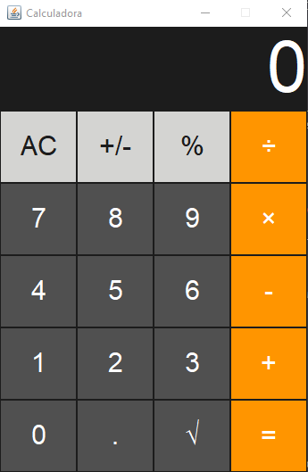

# 📟 Calculadora Java

Este projeto é uma calculadora simples desenvolvida em **Java**. O objetivo é praticar os conceitos básicos de **programação orientada a objetos**, **estrutura de decisão** e **operações matemáticas**.

## 🖼️ Demonstração



## ✨ Funcionalidades

- ✅ Adição  
- ✅ Subtração  
- ✅ Multiplicação  
- ✅ Divisão  
- ✅ Interface grafíca 

## 💻 Tecnologias utilizadas

- Java JDK 17+
- Editor de código (VS Code)

## 🚀 Como executar

1. Clone o repositório:
   ```bash
   git clone https://github.com/Carloscb124/Calculadora_Java.git
